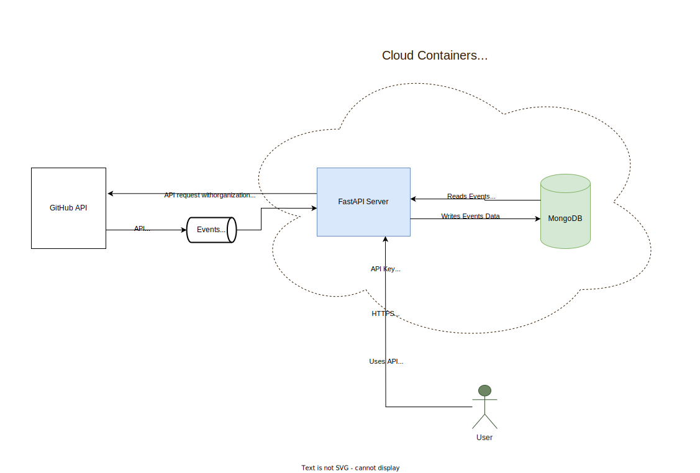
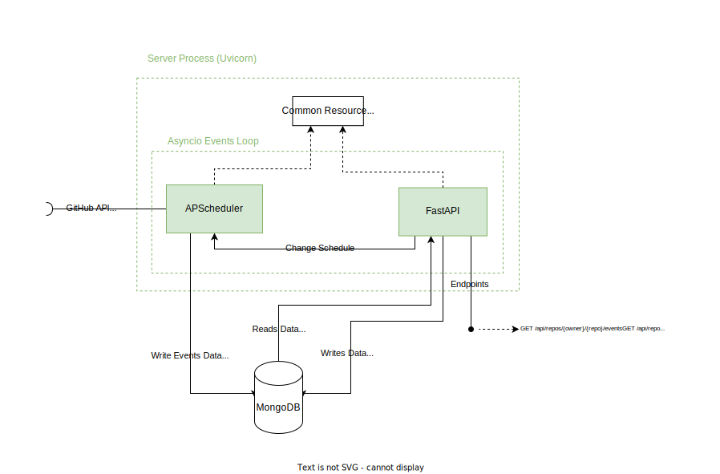
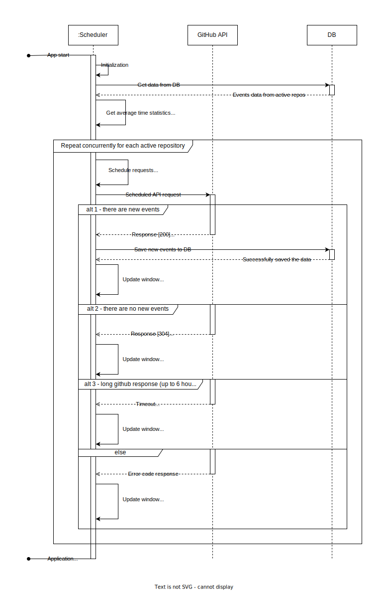

# System Design of GitHub Repository Events Monitoring Application

## Task Assignment

The objective of this assignment is to track activities on GitHub. To achieve this, utilize the GitHub Events API. The
application should monitor up to five configurable repositories and generate statistics based on a rolling window of
either 7 days or 500 events, whichever is less. These statistics are made available to end-users via a REST API, showing
the average time between consecutive events, separately for each combination of event type and repository name. The
application should minimize requests to the GitHub API and retain data through application restarts.

## Contents

## Architecture

Overall application architecture:



## Components Design

### GitHub API

Github API supports different strategies on how to use the API:

- Unauthenticated access
    - Only 60 requests per hour are available.
- Authenticated access
    - 5000 requests per hour.
    - Different authentication flows (Personal Access Token, GitHub App, OAuth)
    - GitHub Enterprise Cloud organization gives 15000 requests per hour.

Some demo uses of GitHub API with different flows are presented in [github_api.ipynb](github_api.ipynb).

#### Obstacles

There are several obstacles and limitations when we use GitHub API:

- There is a limit on API calls from the GitHub API.
- Events are paginated.
- Only events created withing the past 90 days are included.
- Only last $\approx$ 300 events are included (documentation implies exactly 300, but in reality it is under 300 and not
  precise).
- Documentation says, that API is not build to serve real-time use cases, depending on the time of day, event latency
  can be anywhere from 30s to 6h.
- Best practices advices to not use concurrent requests (though up to 100 concurrent requests is possible).

#### Proposed approach

After thorough consideration of each option, the best solution will be using organizational personal access token flow:

- Create GitHub organization.
- Create Personal Access Token for the organization.
- Use authenticated API utilizing resources of the organization.
- Use conditional requests to check if there were new events to avoid rate limit usage.
- If needed, send requests to check API rate limit. Such requests does not affect rate limit.

TODO - IF THERE IS A TIME, BUSINESS ACTIVITY DIAGRAM HERE PLEASE

#### Alternatives

Other authentication flows can be used, but they require more complexity and are not ideal for our use case:

- GitHub App - should be created by organization and installed on that organization, requires management of private
  keys, and uses JWT tokens for authentication, which means we need to monitor expiration of tokens. Overall for this
  application it has an overkill complexity.
- OAuth - can be used only on behalf of some user to take his resources. Authentication is also very complex for this
  application.

### Server

There are 2 main components:

- Web Server - we will use FastAPI python framework. Like Flask, it is very simple and very useful when we need to write
  API very fast.
- Scheduler - for data gathering we will use APSchedule python framework, which allows to plan tasks execution, like
  sending requests to GitHub API.

Both components will run in the same process concurrently, accessing common resources - like modules, database
connections and configurations.



#### GitHub API use

For our case we need to use only following endpoints:

- `GET /repos/{owner}/{repo}/events` - endpoint to get events.
    - Query parameters:
        - `per_page` - number of results per page.
        - `page` - page number of the results to fetch.
    - Header attributes:
        - `Authentication: Bearer {organization access token}`
        - `last-modified` - response attribute - when data were last modified.
        - `if-modified-since` - used with last-modified to make conditional request, and get data only when there are
          new events. It also can be used to filter older events and save the newest.

- `GET /rate_limit` - get information about our rate limit. Does not increase requests use count.

Example of event scheme:

```json
{
  "id": "43756195112",
  "type": "PushEvent",
  "actor": {
    "id": 68920274,
    "login": "eleazar-rivas",
    "display_login": "eleazar-rivas",
    "gravatar_id": "",
    "url": "https://api.github.com/users/eleazar-rivas",
    "avatar_url": "https://avatars.githubusercontent.com/u/68920274?"
  },
  "repo": {
    "id": 879455410,
    "name": "eleazar-rivas/ESET-KeyGen-2024",
    "url": "https://api.github.com/repos/eleazar-rivas/ESET-KeyGen-2024"
  },
  "payload": {
    "repository_id": 879455410,
    "push_id": 21180234309,
    "size": 1,
    "distinct_size": 1,
    "ref": "refs/heads/master",
    "head": "0e3d96550524b41fdace6542aa45d9f8010e6e1b",
    "before": "831a60d3aa9d226bfe9cf67c817c8ba322a8f5d2",
    "commits": [
      {
        "sha": "0e3d96550524b41fdace6542aa45d9f8010e6e1b",
        "author": {
          "email": "68920274+eleazar-rivas@users.noreply.github.com",
          "name": "eleazar-rivas"
        },
        "message": "Commit",
        "distinct": true,
        "url": "https://api.github.com/repos/eleazar-rivas/ESET-KeyGen-2024/commits/0e3d96550524b41fdace6542aa45d9f8010e6e1b"
      }
    ]
  },
  "public": true,
  "created_at": "2024-11-12T20:13:10Z"
}
```

- Events are sorted by `created_at` (FIFO) - the fact that it is sorted is not documented, but it was confirmed
  empirically in the api demo.
- `type` field represents event type: `PushEvent` in the example above. Other example can be seen here
  in [documentation](https://docs.github.com/en/rest/using-the-rest-api/github-event-types?apiVersion=2022-11-28).

Some demo uses of GitHub API can be found here [github_api.ipynb](github_api.ipynb).

#### Scheduler

We will use Advanced Python Scheduler to manage data gathering.

##### Proposed approach

Simplified sequence diagram to show how the scheduler will work:



1. Scheduler Initialization
    - Get data from the database (active repositories and their last events).
    - Store last events in a window (either last 7 days or 500 events, whichever is less).
    - Compute time differences between consecutive events.
2. For each active repository schedule concurrent request call tasks.
    - Tasks are scheduled based on average time interval between events.
    - After each request, depending on the result, different rescheduling strategies will be used, in accordance to best
      practices of GitHub API use.

#### GitHub API calls minimization

To minimize number of API calls, we use following strategy:

- average time between events is also an estimation when to plan the next request.
    - it is simple and is a good start (baseline) for this kind of application.
    - it is adaptive.
- We use conditional requests - checking if there are new events before accessing events data.

Later we could try another strategies to reduce number of API calls even more (which will lead to lesser resources
consumption):

- use time series analysis:
    - SARIMA models
    - Kalman Filter for online prediction
- Other predictive models.

It is worth to mention, that it is not possible to use webhooks for this application. Webhooks would allow complete
minimization of API calls, but to use webhooks, repository owner should give certain permissions to organization, which
is not usable in our context.

#### Application API Endpoints

- To external user will be provided API to manipulate repositories, get events data and events statistics.
- API tries to be compatible with GitHub API, so it is more intuitive to use for other developers.
- Also, as a bonus from FastAPI framework, endpoint with REST API documentation will be automatically provided.

##### API:

- `GET /api/repos/{owner}/{repo}/events/` - get events from specified repository.
    - Query parameters:
        - `type` - gets events of specified type.
        - other necessary query parameters...
- `GET /api/repos/{owner}/{repo}/events/stats/` - get average time between events from specified repository.
    - Query parameters:
        - `type` - gets average time statistics of events of the specified type.
        - other necessary query parameters...
- `GET /api/repos/` - gets all the repositories
- `GET /api/repos/active/` - gets all the active repositories
- `POST /api/repos/{owner}/{repo}/activate` - activate some repositories, so the scheduler can gather data for this
  repository.
- `POST /api/repos/{owner}/{repo}/deactivate` - deactivate some repositories.
- `POST /api/repos/` - add some repos to database.
- `GET /api/docs` - shows API documentation.

##### Security

To limit usage of the API only for authorized users, API Key will used:

- it is a very simple approach for this kind of application.
- API Key should be used with HTTPS, which can be provided by cloud providers.
- API Key security middleware will be used to filter unauthorized requests.

### Database

The best database for this use case will be MongoDB:

- is excellent for rapid development and simple applications.
- is very well suited for storing json data.
- different events have different payloads, MongoDB is schema-less, so there will be no problem to store events of any
  type.

There will be two entities (collections):

- repositories
    - url - url to repository.
    - active - if repository is active or not.
    - other fields necessary for implementation.
- events
    - json data from github

## Deployment

### Local Development

For local development we will use docker-compose with two images:

- MongoDB
- Our server image, built from Dockerfile

### Cloud (AWS)

For deployment we will use AWS:

- GitHub Actions will be used for automatic deployment:
    - Running test, linters, making other checks
    - Building image
    - Registering image with AWS Elastic Container Registry
    - deploying image on cloud
- For database we will use Amazon DocumentDB (which uses MongoDB underneath)
